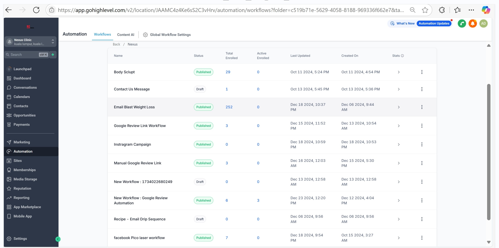
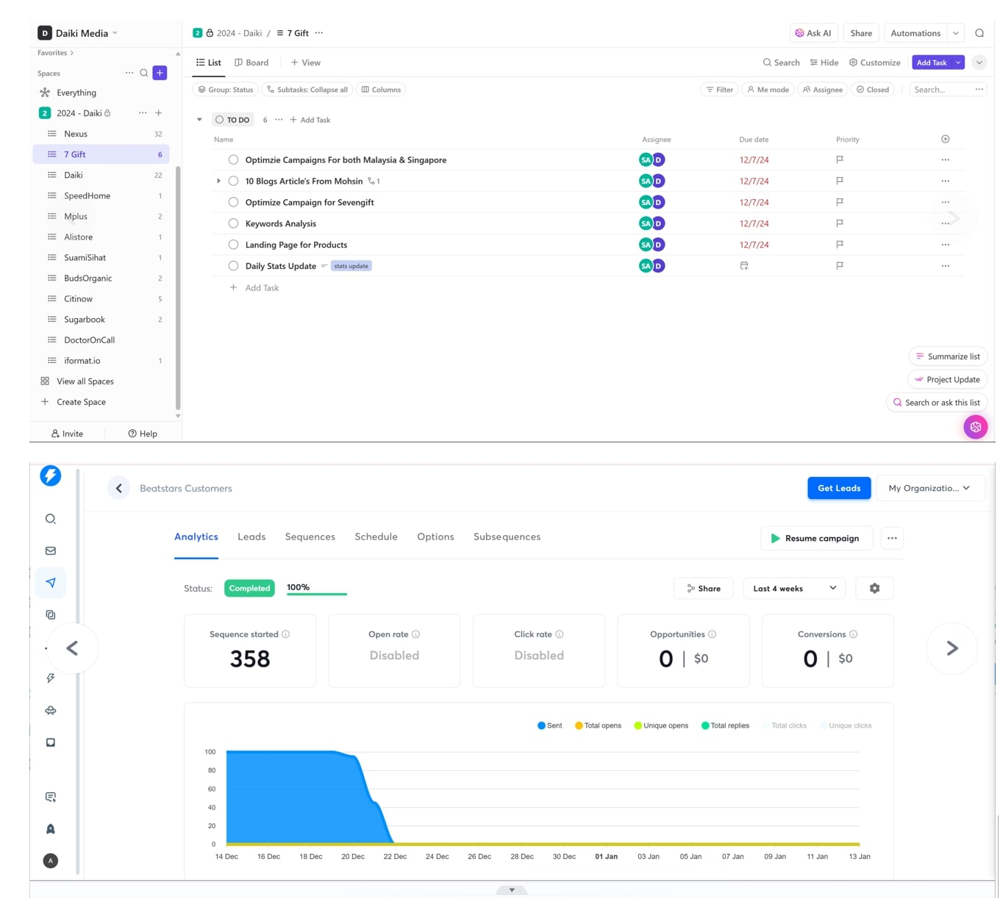
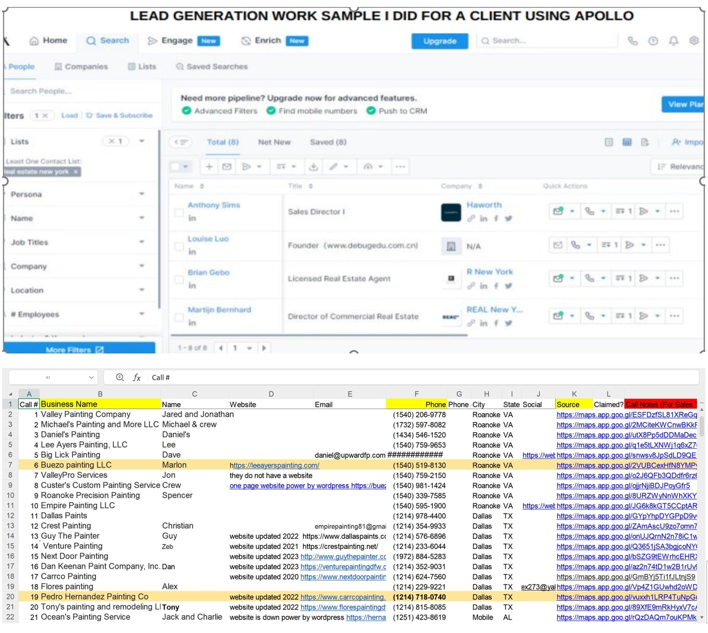
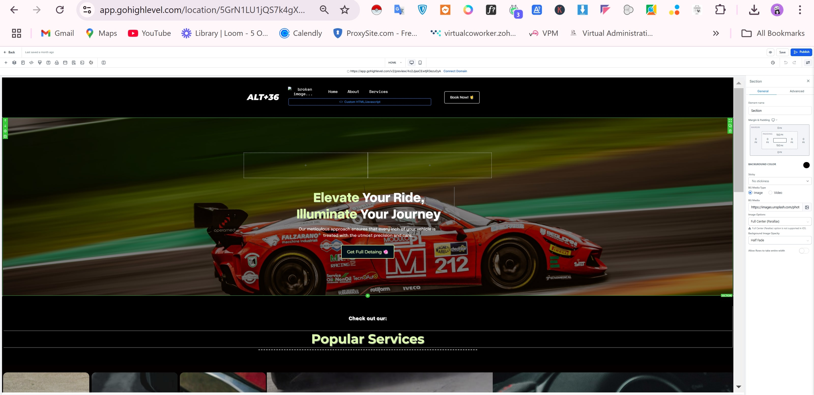
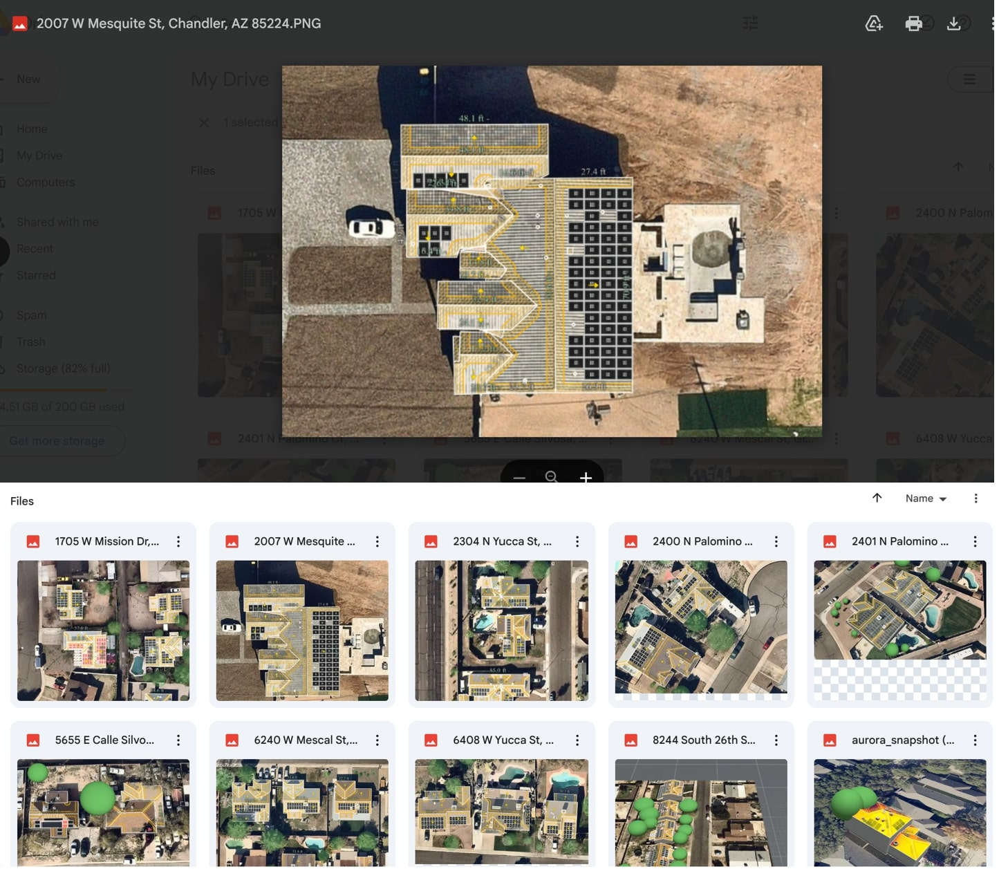

 # Audu Abass - Portfolio

Hello! I’m **Audu Abass** 🤓, **results-driven professional**  with expertise in **operations management**, **lead generation**, **sales**, **web development**, and **customer service**. I help businesses optimize processes, automate workflows, and drive growth through data-driven strategies.

## About Me
I am a versatile professional with a proven ability to drive business success by streamlining operations, optimizing workflows, and delivering exceptional administrative and project management support. My expertise spans **project management**, **automation**, **lead generation**, and **financial processes**. My goal is to enable organizations to operate efficiently, allowing key team members to focus on strategic goals.

I have experience working with various tools such as **GoHighLevel**, **ClickUp**, **Trello**, **Monday.com**, **Google Workspace**, **QuickBooks**, **Mailchimp**, and more. I specialize in leveraging these tools to create optimized workflows, improve lead generation strategies, and ensure seamless business operations.

## What I Do
With years of experience across diverse industries, I specialize in providing solutions that enhance business efficiency and profitability.

- ✅ **Data Analytics & Automation**  
  I leverage tools like **GoHighLevel**, **ClickUp**, and **BigCommerce** to streamline workflows, automate marketing, and improve business performance.

- ✅ **Lead Generation & Sales Optimization**  
  I **generate high-quality leads**, optimize conversion rates, and execute strategies that drive revenue growth.

- ✅ **Operations & Process Improvement**  
  From financial reconciliation to CRM management, I ensure seamless operations that enhance customer experience and business efficiency.

## My Portfolio

### Workflow Automation Email Campaign
  
🚀 Designed an automated email campaign that increased customer engagement and boosted conversion rates.

### Automated Marketing Campaigns in GoHighLevel
  
📈 Implemented automated marketing workflows, reducing manual follow-ups by 30% and improving customer retention rates.

### SEO-Optimized Content Strategy for Daiki Media
  
🔍 Managed content strategy for 100+ SEO articles, leading to increased organic traffic and lead generation.

### Sales Process Automation for TUDS
  
💡 Optimized the e-commerce sales process, boosting conversion rates by 20% and enhancing user experience.

### Lead Generation for Intel Capitol
  
📊 Developed targeted lead generation strategies that resulted in a **25% increase in qualified leads and a 15% boost in overall sales conversions**.

### Web Development for Intel Capitol
  
🖥️ Designed and developed a **responsive website**, improving navigation, speed, and functionality while integrating CRM tools for seamless lead management.

### Solar Designer for Nerdfam
  
🔆 Developed **custom solar panel system designs**, improving project timelines by 20% with accurate planning and detailed designs.

[Download the Full Report (PDF)](assets/portfolio-report.pdf)

---

## How I Can Elevate Your Organization

### **Accounts Payable (AP) and Receivable (AR) Management**
- Process invoices and payments with attention to detail.
- Track and manage receivables for timely collections.
- Prepare reports on project progress and financial metrics.

### **Project Management**
- Develop project plans with tasks, timelines, and milestones.
- Utilize Trello, Asana, and Monday.com for tracking progress.
- Provide updates on key performance indicators (KPIs).
- [Project Managment](https://drive.google.com/drive/folders/1Sr02-cBsgTHrmqm8__7dUnGjicwLkyK8?usp=sharing)

### **General Administration**
- Manage schedules, coordinate meetings, and handle correspondence.
- Draft and format documents, reports, and presentations.
- [View My General Admin Task](https://drive.google.com/drive/folders/17rfw7KLf-c9W8AnZIId33tudhy_bcavN?usp=sharing)

### **Lead Generation**
- Gather and maintain organized databases of leads.
- Conduct research to identify potential clients and markets.
- Utilize social media and online platforms to generate leads.
- [View My Lead Generated](https://drive.google.com/drive/folders/1gxC47yc8mipVn05AeCu2Jd_5X_Cw73xv?usp=sharing)

### **Customer Support**
- Address inquiries promptly and professionally.
- Cultivate and nurture client relationships to expand the clientele base.
- [View My Customer Support](https://drive.google.com/drive/folders/1mY-BN-6BFDm5cg4it9v1rSHVsE27VaN6?usp=sharing)

### **Web Development (using GoHighLevel)**
- Design user-friendly websites and landing pages.
- Integrate CRM systems for seamless lead management.
- [View My Web Development](https://drive.google.com/drive/folders/1aBnBL008tZ3pt6i_1yP03fiyHnWfHjnr?usp=sharing)
- 
### **Social Media Marketing (using Meta Business Suite)**
- Create and manage content across platforms.
- Analyze metrics to optimize strategies and engagement.
- [Social Media](https:///drive.google.com/drive/folders/1K_D7g2ZF_Qw8M7wmmwi7wNsvljjavlZ4?usp=sharing)
- 
### **Email Marketing**
- Design and execute campaigns using Mailchimp or ActiveCampaign.
- Segment lists for targeted messaging and higher engagement rates.
- [View My email marketing](https://drive.google.com/drive/folders/1DswwT29pEEm4rNmXys7jkz9ozXBc2uZn?usp=sharing)

### **Microsoft 365 (M365) Expertise**
- Generating weekly and monthly financial reports.
- Providing transcription and note-taking services.
- Creating forms, social media posts, and project documents (e.g., project charter, submittals, reports).
- Project planning and scheduling using tools like Trello, ClickUp, Asana, Monday.com, Microsoft Project, and Jira.
- Managing phone systems and integrating platforms like Smrtphone.io, Google Voice, and Podio.
- Executing marketing automation and CRM strategies with GoHighLevel, Hivemind, Zoho, and Zendesk.
- Processing payments via Stripe and creating power automate flows and Zap Automations.
- Developing and maintaining project tracking systems, providing regular updates, and identifying operational improvement opportunities.
- Serving as a master project scheduler, ensuring all activities align with project timelines and objectives, and utilizing Gantt charts for project visualization.

---

## Tools I Use

- 🎯 Project Management: Trello, Asana, Monday.com, Smartsheet, Microsoft Project, JIRA
- 💰 Financial Management: QuickBooks, Sage360, Stripe
- 📊 Data Management: GoHighLevel, Google Workspace
- 📞 CRM: Odoo, Zoho, Hivemind, Zendesk
- 📱 Social Media & Marketing: Meta Business Suite, Canva, Mailchimp, ActiveCampaign
- 💻 Web Development: WordPress, GoHighLevel
  
---

## Certifications

✅ Customer Relationship Management (CRM) Fundamentals

✅ Power Start in Project Management 3.0

✅ Certified Virtual Assistant

✅ Customer Success Management Fundamentals

✅ Advanced Excel Proficiency

📂[View My Certifications](https://drive.google.com/drive/folders/1veH38Txy3VCygbfRc1u5TOaV9GjcTgt9)

---

## Why Work With Me?
💡 Strategic Thinker: I analyze business needs and provide solutions that drive efficiency.

🔄 Tech-Savvy & Automation Expert: I use automation tools to eliminate repetitive tasks and improve workflow.

🌍 Flexible & Reliable: I work across multiple time zones and maintain strong communication.

🖥️ Dedicated Home Office: I operate from a distraction-free workspace with dual monitors and fast internet.

📢 Let’s discuss how I can add value to your business.

---

## Contact Details
Let's connect and explore how we can collaborate!
- 📧 [Email Me](mailto:auduabass2015@gmail.com)
- 📞 +2348039247443
- 🌐 [LinkedIn](https://www.linkedin.com/in/audu-abass-1121a395)
- 💼 [View My Portfolio](https://your-username.github.io)
- 📄 [View My Resume](https://drive.google.com/file/d/1WcRzeNNR_VtOatAc6Hcj1Ve_3BROhyUp/view?usp=sharing)

---

### Testimonials
*“He is awesome and works his tail off! I'd hire him every time.”*  
*“Audu is an excellent freelancer. Very bright and committed to producing top-tier work. He has a willingness to learn and master new tasks. Strongly recommend hiring him.”*

